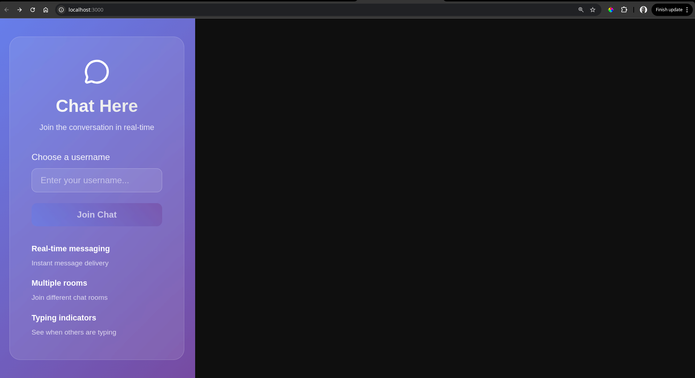
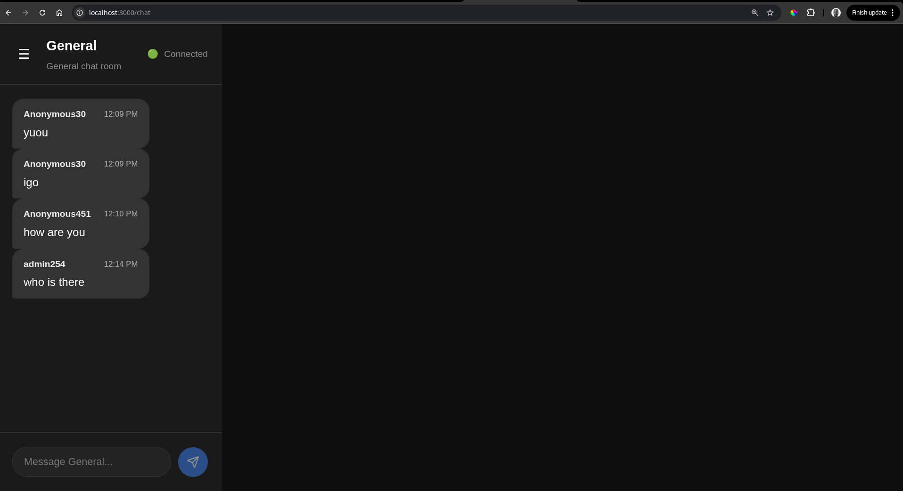
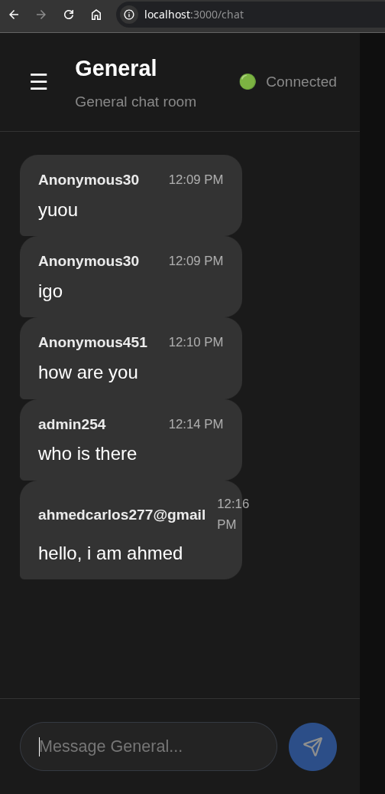
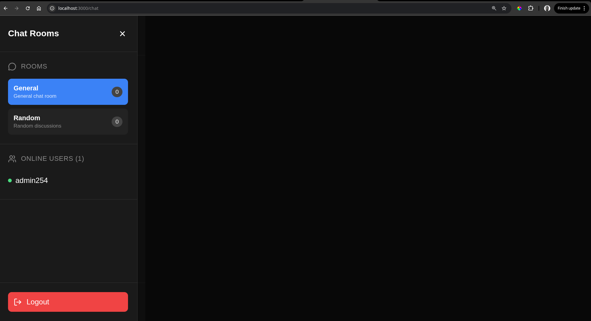
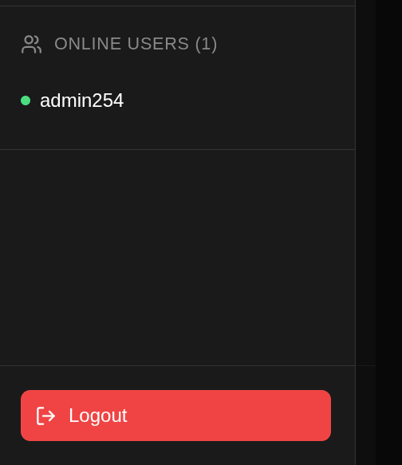

#  Real-Time Chat Application with Socket.io- PLP week 5

A modern, feature-rich real-time chat application built with React, Node.js, and Socket.io. This application demonstrates bidirectional communication between clients and server with advanced chat features and real-time notifications.


##  Application Screenshots

### Homepage & Authentication

*Clean and modern login interface where users can enter their username to join the chat*

### Chat Interface

*Main chat interface showing real-time messaging in the General room*

### Multiple Users Chat

*Demonstration of multiple users chatting simultaneously in real-time*

### Room Management

*Sidebar showing available chat rooms and room switching functionality*

### User Presence

*Online users list showing real-time presence indicators*

##  Features Implemented

###  Core Features (Task 1 & 2)
- **Real-time Messaging**: Instant message delivery using Socket.io
- **User Authentication**: Simple username-based authentication
- **Multiple Chat Rooms**: Pre-configured rooms (General, Random)
- **Online Status**: Real-time user presence indicators
- **Typing Indicators**: See when other users are typing
- **Message Timestamps**: Display message sent times
- **Responsive Design**: Works on desktop and mobile devices

###  Advanced Features (Task 3)
- **Private Messaging**: Direct messages between users
- **Multiple Chat Rooms**: Switch between different rooms
- **Typing Indicators**: Real-time typing notifications
- **Message Reactions**: React to messages with emojis
- **Read Receipts**: See when messages are read
- **User Presence**: Live online/offline status updates

###  Real-Time Notifications (Task 4)
- **Browser Notifications**: Native browser notifications for new messages
- **User Join/Leave Alerts**: Notifications when users enter/leave rooms
- **Unread Message Count**: Track unread messages per room
- **Sound Notifications**: Audio alerts for new messages
- **Real-time Updates**: Instant notification delivery

###  Performance & UX (Task 5)
- **Auto-reconnection**: Handles connection drops gracefully
- **Message History**: Persistent message history per room
- **Optimized Socket.io**: Efficient room-based messaging
- **Error Handling**: Comprehensive error states and loading indicators
- **Mobile-First Design**: Responsive across all device sizes

##  Technology Stack

### Frontend
- **React 18** - Modern React with hooks
- **Vite** - Fast build tool and dev server
- **Socket.io Client** - Real-time communication
- **Lucide React** - Beautiful icons
- **CSS3** - Custom responsive styling

### Backend
- **Node.js** - Runtime environment
- **Express.js** - Web server framework
- **Socket.io** - Real-time bidirectional communication
- **CORS** - Cross-origin resource sharing
- **UUID** - Unique identifier generation

##  Prerequisites

- Node.js (v18 or higher)
- npm or yarn package manager
- Modern web browser with WebSocket support

##  Quick Start

### 1. Clone the Repository
```bash
git clone https://github.com/PLP-MERN-Stack-Development/real-time-communication-with-socket-io-Topher254.git
cd real-time-communication-with-socket-io
```

### 2. Setup Backend Server
```bash
# Navigate to server directory
cd server

# Install dependencies
npm install

# Set up environment variables
cp .env.example .env
# Edit .env with your configuration

# Start development server
npm run dev
```
Server will run on `http://localhost:3001`

### 3. Setup Frontend Client
```bash
# Navigate to client directory (in new terminal)
cd client

# Install dependencies
npm install

# Set up environment variables
cp .env.example .env
# Edit .env with your configuration

# Start development server
npm run dev
```
Client will run on `http://localhost:3000`

## ⚙️ Configuration

### Server Environment Variables (`server/.env`)
```env
NODE_ENV=development
PORT=3001
CLIENT_URL=http://localhost:3000
JWT_SECRET=your-super-secret-key-here
```

### Client Environment Variables (`client/.env`)
```env
VITE_SERVER_URL=http://localhost:3001
```

##  Project Structure

```
real-time-communication-with-socket-io/
├── server/                 # Backend server
│   ├── config/            # Configuration files
│   ├── socket/            # Socket.io event handlers
│   ├── routes/            # Express routes
│   ├── middleware/        # Custom middleware
│   └── server.js          # Main server file
├── client/                # Frontend React app
│   ├── src/
│   │   ├── components/    # Reusable UI components
│   │   ├── context/       # React context providers
│   │   ├── pages/         # Page components
│   │   ├── hooks/         # Custom React hooks
│   │   └── styles/        # CSS stylesheets
│   └── public/            # Static assets
├── screenshots/           # Application screenshots
└── README.md              # Project documentation
```

## 🔌 API Endpoints

### HTTP Routes
- `GET /api/health` - Health check endpoint
- `GET /api/stats` - Server statistics

### Socket Events

#### Client to Server
- `join_room` - Join a chat room
- `send_message` - Send a message to room
- `typing_start` - Start typing indicator
- `typing_stop` - Stop typing indicator
- `react_to_message` - Add reaction to message
- `mark_message_read` - Mark message as read
- `send_private_message` - Send private message to user

#### Server to Client
- `new_message` - Receive new message
- `user_connected` - User came online
- `user_disconnected` - User went offline
- `user_typing` - User started typing
- `user_stop_typing` - User stopped typing
- `notification` - Real-time notification
- `room_joined` - Successfully joined room
- `message_reacted` - Message reaction update

## Author
Sarota Raphael